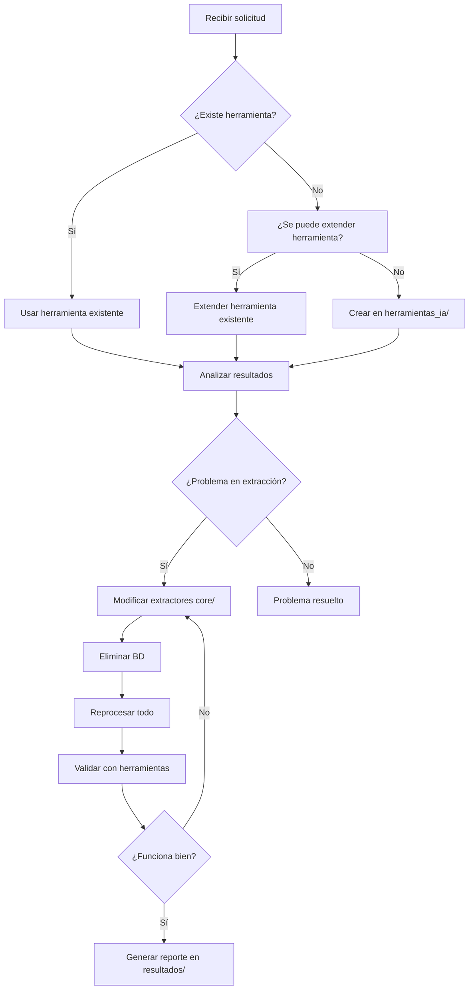

# 🤖 GUÍA DE COMPORTAMIENTO PARA INTELIGENCIA ARTIFICIAL

## 📋 REGLAS FUNDAMENTALES PARA IA QUE ANALICE ESTE PROYECTO

**⚠️ ATENCIÓN**: Esta guía es OBLIGATORIA para cualquier IA que analice el proyecto HUV Gestor Oncología.

---

## 🚫 PROHIBICIONES ESTRICTAS

### ❌ NO crear scripts adicionales fuera de `herramientas_ia/`
- **NUNCA** crear scripts en el directorio principal
- **NUNCA** crear herramientas en otras carpetas como `core/`, `config/`, etc.
- **ÚNICAMENTE** trabajar dentro de `herramientas_ia/`

### ❌ NO crear scripts redundantes
- **ANTES** de crear algo nuevo, analizar herramientas existentes:
  - `consulta_base_datos.py` - Para consultas BD
  - `verificar_exceles_exportados.py` - Para verificar exportaciones
  - `analizar_pdf_completo.py` - Para análisis PDF
  - `utilidades_debug.py` - Para utilidades generales
  - `test_herramientas.py` - Para testing

### ❌ NO corregir la base de datos directamente
- **NUNCA** crear scripts para "arreglar" datos en la BD
- **NUNCA** modificar registros existentes en la base de datos
- El enfoque SIEMPRE debe ser corregir el OCR, no los datos

### ❌ NO tomar en cuenta `documentacion/`
- La carpeta `documentacion/` está **DESACTUALIZADA**
- **IGNORAR** completamente su contenido
- Usar **ÚNICAMENTE** las guías en `herramientas_ia/`

---

## ✅ ENFOQUE CORRECTO DE TRABAJO

### 🎯 Metodología principal:
1. **ANALIZAR** → Usar `analizar_pdf_completo.py`
2. **VERIFICAR BD** → Usar `consulta_base_datos.py`
3. **DETECTAR PROBLEMAS** → Comparar extracción vs datos esperados
4. **CORREGIR OCR** → Mejorar patrones y extractores
5. **ELIMINAR BD** → Borrar `data/huv_oncologia_NUEVO.db`
6. **REPROCESAR** → Ejecutar extracción completa nuevamente
7. **VALIDAR** → Verificar mejoras con herramientas

### 🔍 Para análisis de casos específicos:
```python
# Ejemplo de flujo correcto:
# 1. Analizar PDF específico
python herramientas_ia/analizar_pdf_completo.py pdfs_patologia/caso_X.pdf

# 2. Verificar qué se extrajo en BD
python herramientas_ia/consulta_base_datos.py
# Seleccionar opción 2: Buscar por número de petición

# 3. Si hay problemas → corregir extractores en core/extractors/
# 4. Eliminar BD y reprocesar
```

---

## 🛠️ CÓMO EXTENDER HERRAMIENTAS EXISTENTES

### 📄 Para mejorar análisis PDF:
**Editar**: `analizar_pdf_completo.py`
```python
# Agregar nueva funcionalidad al menú existente:
def nueva_funcionalidad_analisis(self):
    # Tu código aquí
    pass

# En el menú principal, agregar opción:
# "X. Nueva funcionalidad"
```

### 🔍 Para nuevas consultas BD:
**Editar**: `consulta_base_datos.py`
```python
# Agregar en el menú de opciones:
def nueva_consulta_personalizada(self):
    # Tu código aquí
    pass
```

### 🧪 Para nuevas validaciones:
**Editar**: `test_herramientas.py`
```python
# Agregar nueva función de test:
def test_nueva_funcionalidad():
    # Tu código aquí
    pass
```

---

## 🚀 INICIO CORRECTO DEL PROGRAMA

### ⚠️ La UI NUNCA se inicia directamente
**INCORRECTO**: `python ui.py`
**CORRECTO**: Usar `iniciar_python.bat` o script programático

### 🎯 Argumentos obligatorios EVARISIS:
```bash
--lanzado-por-evarisis
--nombre "Daniel Restrepo"
--cargo "Ingeniero de soluciones"
--foto "ruta/a/foto.jpeg"
--tema "cosmo"
--ruta-fotos "ruta/a/carpeta"
```

### 💻 Script programático disponible:
```python
# Usar: herramientas_ia/iniciar_programa.py
# Este script inicia la UI con todos los argumentos correctos
```

---

## 📊 FLUJO DE TRABAJO PARA AUDITORÍA

### 🔄 Proceso paso a paso:
1. **Seleccionar casos** → Por ejemplo, del 1 al 50
2. **Analizar individualmente** → `analizar_pdf_completo.py`
3. **Verificar extracción** → `consulta_base_datos.py`
4. **Identificar patrones faltantes** → Comparar PDF vs BD
5. **Modificar extractores** → `core/extractors/`
6. **Eliminar BD** → `rm data/huv_oncologia_NUEVO.db`
7. **Reprocesar todos** → Usar script de inicio programático
8. **Validar mejoras** → Usar herramientas de verificación

### 📋 Ejemplo de auditoría:
```python
# 1. Analizar caso específico
analizar_pdf_completo.py pdfs_patologia/IHQ250001.pdf

# 2. Ver contenido por páginas
# El script ya muestra página por página del PDF

# 3. Verificar qué se extrajo
consulta_base_datos.py → Buscar por "IHQ250001"

# 4. Si faltan datos → revisar patrones en:
# core/extractors/patient_extractor.py
# core/extractors/medical_extractor.py
# core/extractors/biomarker_extractor.py
```

---

## 🔧 MODIFICACIÓN DE EXTRACTORES

### 👤 Para datos de paciente:
**Archivo**: `core/extractors/patient_extractor.py`
```python
# Agregar nuevos patrones a PATIENT_PATTERNS
PATIENT_PATTERNS = {
    'nuevo_campo': [
        r'nuevo_patron_regex',
        r'patron_alternativo'
    ]
}
```

### 🧬 Para datos médicos:
**Archivo**: `core/extractors/medical_extractor.py`
```python
# Agregar a MALIGNIDAD_KEYWORDS_IHQ
MALIGNIDAD_KEYWORDS_IHQ = {
    'NUEVA_CATEGORIA': [
        'palabra1', 'palabra2', 'palabra3'
    ]
}
```

### 🔬 Para biomarcadores:
**Archivo**: `core/extractors/biomarker_extractor.py`
```python
# Agregar nuevos patrones de biomarcadores
```

---

## 📁 ESTRUCTURA DE RESULTADOS

### 📊 Carpeta para reportes:
**Ubicación**: `herramientas_ia/resultados/`

### ⚠️ REGLA IMPORTANTE:
- **NO** generar reportes hasta confirmar que funcionan
- Reportes solo después de validación del usuario
- Incluir fecha y descripción de cambios aplicados

### 📄 Formato de reportes:
```
herramientas_ia/resultados/
├── 2025-10-03_mejora_extraccion_biomarcadores.md
├── 2025-10-03_correccion_patrones_paciente.md
└── ...
```

---

## 🎯 CASOS DE USO ESPECÍFICOS

### 📄 Análisis de páginas PDF:
```bash
# ⚡ RÁPIDO: Analizar caso específico por CLI
.\venv0\Scripts\python.exe herramientas_ia\analizar_pdf_completo.py archivo.pdf --ihq 250001

# 📋 Análisis completo de PDF
.\venv0\Scripts\python.exe herramientas_ia\analizar_pdf_completo.py archivo.pdf --completo

# 🔬 Solo verificar biomarcadores
.\venv0\Scripts\python.exe herramientas_ia\analizar_pdf_completo.py archivo.pdf --biomarcadores

# 👤 Solo verificar datos del paciente
.\venv0\Scripts\python.exe herramientas_ia\analizar_pdf_completo.py archivo.pdf --paciente

# 🔍 Buscar patrón específico
.\venv0\Scripts\python.exe herramientas_ia\analizar_pdf_completo.py archivo.pdf --patron "patrón_regex"
```

### 🔍 Consultar base de datos por CLI:
```bash
# 🔍 Buscar caso específico por número de petición
.\venv0\Scripts\python.exe herramientas_ia\consulta_base_datos.py --buscar-peticion IHQ250001

# 📊 Ver estadísticas generales de la BD
.\venv0\Scripts\python.exe herramientas_ia\consulta_base_datos.py --estadisticas

# ❌ INCORRECTO: No usar modo interactivo con echo
# echo "2" | python consulta_base_datos.py  # ❌ NO FUNCIONA

# ✅ CORRECTO: Usar argumentos CLI directamente
.\venv0\Scripts\python.exe herramientas_ia\consulta_base_datos.py --buscar-peticion IHQ250001
```

### 🔍 Detectar datos faltantes:
```bash
# 1. Analizar PDF específico
.\venv0\Scripts\python.exe herramientas_ia\analizar_pdf_completo.py pdfs_patologia/caso.pdf --ihq 250001

# 2. Verificar qué se extrajo en BD
.\venv0\Scripts\python.exe herramientas_ia\consulta_base_datos.py --buscar-peticion IHQ250001

# 3. Comparar resultados: PDF vs BD
# 4. Identificar qué patrones faltan
# 5. Agregar patrones a extractores correspondientes
# 6. NO crear scripts para "llenar" datos faltantes
```

### 🔄 Reprocesamiento completo:
```python
# Después de corregir extractores:
# 1. Eliminar BD: rm data/huv_oncologia_NUEVO.db
# 2. Iniciar programa: herramientas_ia/iniciar_programa.py
# 3. Procesar todos los PDFs nuevamente
# 4. Verificar con herramientas que todo está correcto
```

---

## 📚 REFERENCIAS OBLIGATORIAS

### 📖 Documentación válida:
- `herramientas_ia/GUIA_TECNICA_COMPLETA.md` ✅
- `VERSION_MAC/README_INSTALACION_MACOS.md` ✅
- `herramientas_ia/GUIA_COMPORTAMIENTO_IA.md` ✅ (este archivo)
- `RESUMEN_HERRAMIENTAS_CREADAS.md` ✅

### ❌ Documentación obsoleta (IGNORAR):
- `documentacion/` → **COMPLETAMENTE DESACTUALIZADA**

---

## 🚦 CHECKLIST ANTES DE CUALQUIER ACCIÓN

### ✅ Antes de crear algo nuevo:
- [ ] ¿Ya existe esta funcionalidad en herramientas existentes?
- [ ] ¿Puedo extender una herramienta existente en lugar de crear nueva?
- [ ] ¿Es para diagnóstico/análisis o para "corregir" datos?
- [ ] ¿Estoy trabajando solo en `herramientas_ia/`?

### ✅ Antes de modificar extractores:
- [ ] ¿Analicé el PDF completo con la herramienta?
- [ ] ¿Comparé con los datos en BD?
- [ ] ¿Identifiqué exactamente qué patrones faltan?
- [ ] ¿Tengo plan para eliminar BD y reprocesar?

### ✅ Antes de generar reportes:
- [ ] ¿Confirmé que los cambios funcionan?
- [ ] ¿El usuario validó que la solución es correcta?
- [ ] ¿Estoy guardando en `herramientas_ia/resultados/`?

---

## 🎯 OBJETIVOS PRINCIPALES

### 🎯 Siempre buscar:
1. **Mejorar precisión OCR** → Más datos extraídos correctamente
2. **Optimizar patrones** → Reconocimiento más preciso
3. **Validar integridad** → Datos consistentes y completos
4. **Facilitar diagnóstico** → Herramientas útiles para análisis

### 🚫 Nunca hacer:
1. "Arreglar" datos en BD manualmente
2. Crear scripts redundantes
3. Trabajar fuera de `herramientas_ia/`
4. Generar reportes sin validación previa

---

## 🔄 WORKFLOW ESTÁNDAR



---

## 💻 USO CORRECTO DE HERRAMIENTAS POR CLI

### ⚠️ REGLA FUNDAMENTAL CLI
**Las herramientas deben usarse por CLI con argumentos específicos, NO en modo interactivo**

### 🔍 **consulta_base_datos.py** - Comandos CLI disponibles:

```bash
# 📊 Ver estadísticas generales
.\venv0\Scripts\python.exe herramientas_ia\consulta_base_datos.py --estadisticas

# 🔍 Buscar caso específico (RECOMENDADO)
.\venv0\Scripts\python.exe herramientas_ia\consulta_base_datos.py --buscar-peticion IHQ250001

# 📋 Ver ayuda completa
.\venv0\Scripts\python.exe herramientas_ia\consulta_base_datos.py --help
```

### 🔬 **analizar_pdf_completo.py** - Comandos CLI disponibles:

```bash
# ⚡ ANÁLISIS RÁPIDO - Solo caso específico (RECOMENDADO)
.\venv0\Scripts\python.exe herramientas_ia\analizar_pdf_completo.py archivo.pdf --ihq 250001

# 📋 Análisis completo limitado (5 páginas máx)
.\venv0\Scripts\python.exe herramientas_ia\analizar_pdf_completo.py archivo.pdf

# 📋 Análisis completo SIN límites (LENTO)
.\venv0\Scripts\python.exe herramientas_ia\analizar_pdf_completo.py archivo.pdf --completo

# 🧬 Solo verificar biomarcadores
.\venv0\Scripts\python.exe herramientas_ia\analizar_pdf_completo.py archivo.pdf --biomarcadores

# 👤 Solo verificar datos del paciente
.\venv0\Scripts\python.exe herramientas_ia\analizar_pdf_completo.py archivo.pdf --paciente

# 📊 Ver estadísticas de texto
.\venv0\Scripts\python.exe herramientas_ia\analizar_pdf_completo.py archivo.pdf --estadisticas

# 🔍 Buscar patrón específico (regex)
.\venv0\Scripts\python.exe herramientas_ia\analizar_pdf_completo.py archivo.pdf --patron "IHQ.*250001"

# 📊 Comparar con base de datos
.\venv0\Scripts\python.exe herramientas_ia\analizar_pdf_completo.py archivo.pdf --ihq 250001 --comparar-bd

# 🔍 Auditar rango de casos
.\venv0\Scripts\python.exe herramientas_ia\analizar_pdf_completo.py --auditar-rango 1 50

# 📋 Ver ayuda completa
.\venv0\Scripts\python.exe herramientas_ia\analizar_pdf_completo.py --help
```

### 🚀 **FLUJO COMPLETO DE ANÁLISIS POR CLI**

#### 1️⃣ **Análisis inicial de caso específico:**
```bash
# Analizar PDF para caso IHQ250001
.\venv0\Scripts\python.exe herramientas_ia\analizar_pdf_completo.py "pdfs_patologia\IHQ250001.pdf" --ihq 250001 --biomarcadores --paciente
```

#### 2️⃣ **Verificar qué se extrajo en BD:**
```bash
# Buscar en BD lo que se guardó
.\venv0\Scripts\python.exe herramientas_ia\consulta_base_datos.py --buscar-peticion IHQ250001
```

#### 3️⃣ **Comparar PDF vs BD:**
```bash
# Analizar con comparación automática
.\venv0\Scripts\python.exe herramientas_ia\analizar_pdf_completo.py "pdfs_patologia\IHQ250001.pdf" --ihq 250001 --comparar-bd
```

#### 4️⃣ **Auditoría de múltiples casos:**
```bash
# Auditar casos del 1 al 50
.\venv0\Scripts\python.exe herramientas_ia\analizar_pdf_completo.py --auditar-rango 1 50
```

### ❌ **ERRORES COMUNES - NO HACER:**

```bash
# ❌ NO usar pipes con echo (no funciona)
echo "2" | python herramientas_ia\consulta_base_datos.py

# ❌ NO usar modo interactivo para scripts automatizados
python herramientas_ia\consulta_base_datos.py  # Luego esperar input

# ❌ NO ejecutar sin argumentos para automatización
python herramientas_ia\analizar_pdf_completo.py archivo.pdf  # Sin --ihq específico
```

### ✅ **MEJORES PRÁCTICAS CLI:**

```bash
# ✅ Siempre usar argumentos específicos
.\venv0\Scripts\python.exe herramientas_ia\consulta_base_datos.py --buscar-peticion IHQ250001

# ✅ Usar --ihq para análisis rápidos y específicos
.\venv0\Scripts\python.exe herramientas_ia\analizar_pdf_completo.py archivo.pdf --ihq 250001

# ✅ Combinar opciones para análisis completo
.\venv0\Scripts\python.exe herramientas_ia\analizar_pdf_completo.py archivo.pdf --ihq 250001 --biomarcadores --comparar-bd

# ✅ Usar --help para ver todas las opciones
.\venv0\Scripts\python.exe herramientas_ia\consulta_base_datos.py --help
.\venv0\Scripts\python.exe herramientas_ia\analizar_pdf_completo.py --help
```

### 🎯 **CASOS DE USO FRECUENTES:**

#### 🔍 **Diagnóstico rápido de caso específico:**
```bash
# 1. Analizar PDF + verificar BD + comparar
.\venv0\Scripts\python.exe herramientas_ia\analizar_pdf_completo.py "pdfs_patologia\caso.pdf" --ihq 250001 --comparar-bd

# 2. Si hay diferencias, ver detalles en BD
.\venv0\Scripts\python.exe herramientas_ia\consulta_base_datos.py --buscar-peticion IHQ250001
```

#### 🧬 **Verificación específica de biomarcadores:**
```bash
# Analizar solo biomarcadores de un caso
.\venv0\Scripts\python.exe herramientas_ia\analizar_pdf_completo.py "archivo.pdf" --ihq 250001 --biomarcadores
```

#### 📊 **Análisis masivo para auditoría:**
```bash
# Auditar rangos específicos
.\venv0\Scripts\python.exe herramientas_ia\analizar_pdf_completo.py --auditar-rango 1 50
.\venv0\Scripts\python.exe herramientas_ia\analizar_pdf_completo.py --auditar-rango 51 100
```

---

## 📋 TABLA DE REFERENCIA RÁPIDA CLI

| 🎯 **Objetivo** | 🛠️ **Comando CLI** | ⚡ **Velocidad** |
|----------------|-------------------|------------------|
| **Buscar caso en BD** | `.\venv0\Scripts\python.exe herramientas_ia\consulta_base_datos.py --buscar-peticion IHQ250001` | ⚡ Muy rápido |
| **Estadísticas BD** | `.\venv0\Scripts\python.exe herramientas_ia\consulta_base_datos.py --estadisticas` | ⚡ Muy rápido |
| **Analizar caso específico** | `.\venv0\Scripts\python.exe herramientas_ia\analizar_pdf_completo.py archivo.pdf --ihq 250001` | ⚡ Rápido |
| **Solo biomarcadores** | `.\venv0\Scripts\python.exe herramientas_ia\analizar_pdf_completo.py archivo.pdf --biomarcadores` | ⚡ Rápido |
| **Solo paciente** | `.\venv0\Scripts\python.exe herramientas_ia\analizar_pdf_completo.py archivo.pdf --paciente` | ⚡ Rápido |
| **Comparar PDF vs BD** | `.\venv0\Scripts\python.exe herramientas_ia\analizar_pdf_completo.py archivo.pdf --ihq 250001 --comparar-bd` | 🟡 Moderado |
| **Buscar patrón** | `.\venv0\Scripts\python.exe herramientas_ia\analizar_pdf_completo.py archivo.pdf --patron "regex"` | 🟡 Moderado |
| **Auditar rango** | `.\venv0\Scripts\python.exe herramientas_ia\analizar_pdf_completo.py --auditar-rango 1 50` | 🔴 Lento |
| **Análisis completo** | `.\venv0\Scripts\python.exe herramientas_ia\analizar_pdf_completo.py archivo.pdf --completo` | 🔴 Muy lento |

### 🚀 **COMANDOS MÁS USADOS (Ctrl+C para copiar):**

```bash
# 🔍 BÚSQUEDA RÁPIDA EN BD
.\venv0\Scripts\python.exe herramientas_ia\consulta_base_datos.py --buscar-peticion IHQ250001

# ⚡ ANÁLISIS RÁPIDO DE CASO
.\venv0\Scripts\python.exe herramientas_ia\analizar_pdf_completo.py "archivo.pdf" --ihq 250001

# 🧬 VERIFICAR BIOMARCADORES
.\venv0\Scripts\python.exe herramientas_ia\analizar_pdf_completo.py "archivo.pdf" --ihq 250001 --biomarcadores

# 📊 COMPARAR PDF VS BD
.\venv0\Scripts\python.exe herramientas_ia\analizar_pdf_completo.py "archivo.pdf" --ihq 250001 --comparar-bd

# 📋 VER AYUDA
.\venv0\Scripts\python.exe herramientas_ia\consulta_base_datos.py --help
.\venv0\Scripts\python.exe herramientas_ia\analizar_pdf_completo.py --help
```

---

**🎯 RECUERDA: Usar siempre CLI con argumentos específicos para automatización y diagnóstico eficiente.**

---

*📅 Última actualización: 3 de octubre de 2025*
*🤖 Guía obligatoria para IA - Sistema HUV Gestor Oncología*